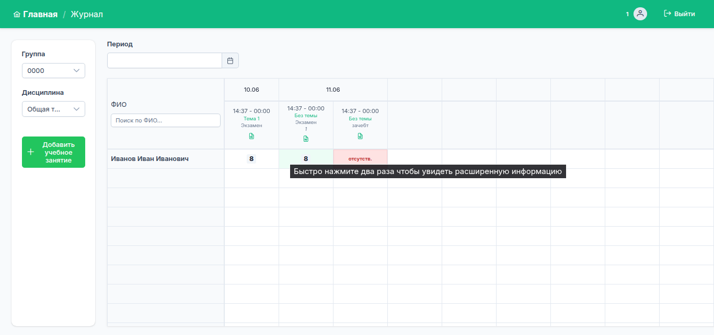

# Электронный журнал

Фронтенд сервиса для учёта посещаемости и отметок обучающихся.

> Работает в связке с закрытым бэкендом,
> поэтому локальный запуск без него невозможен.



---

## Стек

- Vue 3 + Composition API
- Pinia, Vue Router 4
- PrimeVue 4
- Axios, Vite

## Возможности

- Табличный журнал отметок и посещаемости с inline-редактированием
- Скачивание ведомости в .docx
- Отчёты по успеваемости и посещаемости с фильтрацией

## Структура проекта

```
src/
├── assets/       # Стили
├── components/   # UI-компоненты
├── composables/  # Переиспользуемая логика
├── config/       # Константы приложения
├── router/       # Маршруты
├── services/     # Работа с API
├── store/        # Pinia-сторы
├── utils/        # Вспомогательные функции
└── views/        # Страницы
```

## Team

- **Frontend** — [Artyom Borodin](https://github.com/a-a-borodin)
- **Backend** — [Evgeny Levenko](https://github.com/levenkoevgeny)
